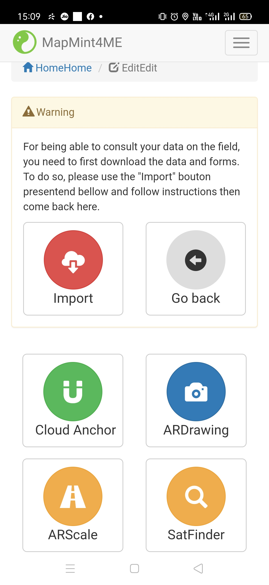
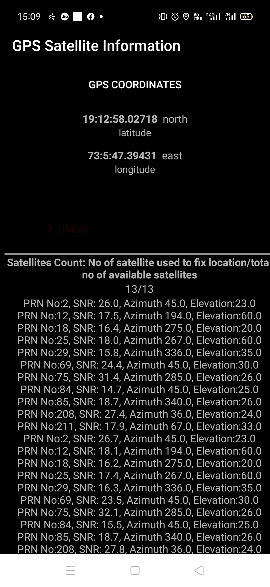

# MapMint4ME_final
* I added the following methods which give more information regarding GPS satellites currently used to fix locations. Satellite information is required because MapMint4ME acquires data without internet
* GPS Coordinated displayed on screen.
* getPrn()  method returns pseudo random number for satellite
* getAzimuth() method  returns azimuth of the satellite in degrees 
* getElevation() method returns  elevation of the satellite in degrees
* getSnr() method returns signal to noise ratio
* usedInFix() method returns Returns true if the satellite was used by the GPS engine when calculating the most recent GPS fix
* Module Integrated with existing MapMint4ME.
* Screenshots:

